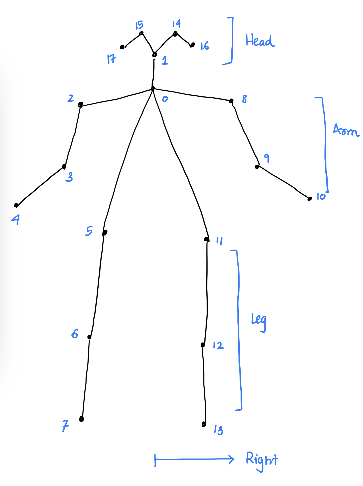
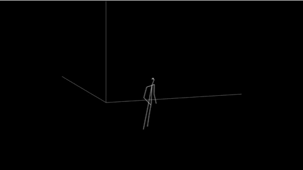

# 3D-Pose-Extraction-and-Rendering

*This repository is a fork of https://github.com/Daniil-Osokin/lightweight-human-pose-estimation-3d-demo.pytorch.git, and contains the extra necessary code for 3D human pose extraction in .npy files and exporting videos of new 3D poses. Please check the setup instructions from https://github.com/Daniil-Osokin/lightweight-human-pose-estimation-3d-demo.pytorch/blob/master/README.md*

## Extraction of 3D Poses

### Pose Structure
The skeleton joints extracted from this respository look like the following: <br>
<p align="center">
  
</p>

Poses extracted from each frame are of the shape (18,3) where each joint 'n' has the 3D coordinate (n,3). 

### Extract 3D Poses
```
python pose_extract.py --model human-pose-estimation-3d.pth --video video_path
```
Extracted poses will be saved in the folder './POSES'

### Render 3D Pose Videos
#### With music
--duration: duration of song to crop (in seconds)
```
python plot_generated.py --joints joints.npy --music music.mp3 --duration 10
python join_sound.py output_name
```
Output: output_name.mp4

#### Without music
```
python plot_generated.py --joints joints.npy
```
Output: rendered.mp4

<p align="center">
  
</p>
